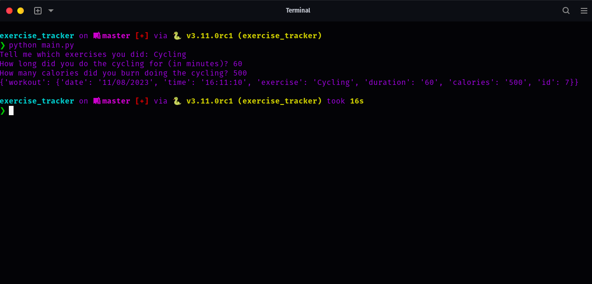

# Python Exercise Tracker

This project is an interactive tool to record your exercises. It interacts with the Nutritionix API to fetch details about exercises and records the details into a Sheety endpoint.

## Getting Started

### Prerequisites

1. Python 3.x
2. Pipenv: Ensure you have `pipenv` installed. If not, you can install it using `pip install pipenv`.

### Setting Up

1. Clone this repository:
   ```bash
   git clone https://github.com/j-breedlove/exercise_tracker.git
   ```
2. Navigate to the project directory and install the dependencies using pipenv:
   ```bash
   cd exercise_tracker
   pipenv install
   ```
3. Activate the pipenv shell:
   ```bash
   pipenv shell
   ```
4. Set up a `.env` file in the root directory with the following format:

```
GENDER=Your_Gender
WEIGHT_KG=Your_Weight_in_KG
HEIGHT_CM=Your_Height_in_CM
AGE=Your_Age
NUTRITIONIX_ENDPOINT=Your_Nutritionix_Endpoint
NUTRITIONIX_API_KEY=Your_Nutritionix_API_Key
NUTRITIONIX_API_ID=Your_Nutritionix_API_ID
SHEETY_ENDPOINT=Your_Sheety_Endpoint
SHEETY_AUTH=Your_Sheety_Auth_Token
BASIC_AUTH_USER=Your_Basic_Auth_Username
BASIC_AUTH_PASS=Your_Basic_Auth_Password
```

Replace the placeholders with appropriate values.

### Usage

Simply run the `main.py` script:

```
python main.py
```

You will be prompted to enter the exercises you did, along with their duration and calories burned. The script will then record these details in the specified Sheety endpoint.

## Contributing

Feel free to fork this repository, make changes, and submit pull requests.

## License

This project is open source and available under the [MIT License](LICENSE).

